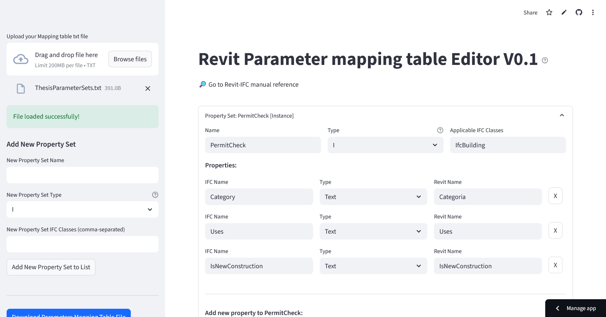

# IFC Property Set Editor V0.1



A Streamlit web application designed to read, display, and edit [Export parameter mapping table](https://autodesk.ifc-manual.com/revit/ifc-export-settings-dialog/property-sets/parameter-mapping-table) file. 
## Features

  * **File Upload:** Upload `UserDefinedParameterSets.txt` (or similarly formatted `.txt` files) to load existing IFC property set definitions.
  * **Structured Display:** Information is displayed in clear blocks, categorizing by Property Set.
  * **Editable Fields:**
      * Edit Property Set name, type (Instance `I` or Type `T`), and applicable IFC classes.
      * Edit individual property's IFC name, data type (e.g., `Text`, `Boolean`), and corresponding Revit parameter name.
  * **Add New Elements:**
      * Add new Property Set blocks with custom names, types, and IFC classes.
      * Add new properties to any existing Property Set.
  * **Remove Elements:**
      * Remove individual properties from a Property Set.
      * Remove entire Property Set blocks.
  * **Download Edited File:** Export your modified property set definitions back into a `.txt` file, preserving the original formatting.

## How to Use

### 1\. Installation

Clone this repository and install the required Python packages:

```bash
git clone https://github.com/your-username/ifc-property-set-editor.git
cd ifc-property-set-editor
pip install -r requirements.txt
```

*(Create a `requirements.txt` file in your project directory with `streamlit` as content)*

### 2\. Running the App

Execute the Streamlit app from your terminal:

```bash
streamlit run ifc_editor_app.py
```

This will open the application in your default web browser.

### 3\. Interacting with the App

1.  **Upload a File:** In the sidebar, use the "Upload your ThesisParameterSets.txt file" button to load your property set definitions.
2.  **Edit Information:**
      * Directly type into the text fields to modify names, types, and IFC classes.
      * Use the dropdown for Property Set Type.
3.  **Add New Property Set:**
      * In the sidebar, fill in the "New Property Set Name", "New Property Set Type", and "New Property Set IFC Classes" fields.
      * Click "Add New Property Set to List".
4.  **Add New Property:**
      * Scroll to the desired Property Set block.
      * Fill in the "New Property IFC Name", "New Property Type", and "New Property Revit Name" fields below that block.
      * Click "Add Property to [Property Set Name]".
5.  **Remove Elements:**
      * Click the "X" button next to a property to remove it.
      * Click "Remove Property Set: [Property Set Name]" to remove an entire block.
6.  **Download Edited File:** At the bottom of the page, click "Download Edited Parameters File" to save your changes to a new `.txt` file.

## File Format

The application expects `.txt` files to follow a specific format:

```
PropertySet:	[PropertySetName]	[Type (I/T)]	[IFCClass1],[IFCClass2]
	[IFCPropertyName]	[DataType]	[RevitParameterName]
	[IFCPropertyName2]	[DataType2]	[RevitParameterName2]

PropertySet:	[AnotherPropertySetName]	[Type (I/T)]	[AnotherIFCClass]
	[PropertyC]	[DataTypeC]	[RevitParamC]
```

  * Each Property Set declaration starts with `PropertySet:`.
  * Properties belonging to a Property Set are indented with a tab (`\t`).
  * Fields are separated by tabs (`\t`).

## Development

The application is built using Python and Streamlit. The core logic involves parsing the text file into a structured Python dictionary and then rendering editable components using Streamlit widgets.

### Project Structure

```
.
├── ifc_editor_app.py   # Main Streamlit application script
└── requirements.txt    # Python dependencies
└── README.md           # This README file
```

## License

This project is licensed under the MIT License - see the [LICENSE](./LICENCE) file for details.

